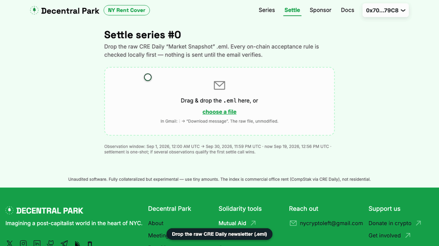

# NY Rent Cover

Fully collateralized, fully permissionless protection against Manhattan office rent staying
high, settled by an email. The oracle input is CRE Daily's "Market Snapshot" newsletter
(**Manhattan Office Rent · Avg Effective $/SF**, CompStak data), verified **entirely on-chain**:
RSA-SHA256 DKIM signature, body hash and template parsing all execute in the EVM against an
immutable pinned key. No committee, no price feed, no trusted server, no ZK ceremony.

**Live app:** https://ronturetzky.github.io/NYRent/



Recorded guides for every flow — fund, buy (the pool currency or any routed token via
Uniswap v3), settle, redeem, withdraw — are on the app's
[in-app guides](https://ronturetzky.github.io/NYRent/#/docs).

- **Anyone underwrites** — there are no roles at all. `createSeries` escrows the creator's own
  capital 1:1 as that series' backing (payout 0 at/below $88.00, 1 at/above $96.00 for the
  demo strikes) and premiums accrue to that series alone; the creator's only levers are
  pausing its own sales, topping up escrow before the sale ends, cancelling while unsold, and
  the one-shot residual withdrawal after the claim window.
- A **buyer** pays a premium (28.50% of max claim in the demo) and mints non-transferable
  ERC-1155 cover units, 1 unit = 1 currency-wei of max claim — backed 1:1 by escrow at the
  moment of purchase. Sales always close before the observation window opens
  (`saleEnd ≤ obsStart` is enforced on-chain), so nobody can buy against an email that may
  already exist.
- **Anyone** may submit an authentic snapshot email to the oracle and settle a series whose
  observation window contains the email's signed timestamp. The 2026-09-17 issue printed
  **$92.88 / SF** ⇒ payout ratio **61%** between the demo strikes.
- Buyers **redeem** `amount × ratio` out of the series escrow; after the redeem window, the
  residual (escrow − payouts + premiums) releases to the series creator.

The settlement statement, trust boundaries, permissionless market structure and limitations
(template drift, key rotation, caveat-emptor series pricing) are in
[docs/PROTOCOL.md](docs/PROTOCOL.md); the pay-with-any-token Uniswap integration in
[docs/UNISWAP.md](docs/UNISWAP.md). The full evidence chain for the pinned DKIM key — DNS
record, fingerprints, Gmail `dkim=pass`, reproducible local verification — is in
[docs/VERIFICATION.md](docs/VERIFICATION.md). ([docs/SPEC.md](docs/SPEC.md) is the frozen
legacy record of the original sponsor-model build.)

**Unaudited. Experimental. The demo series uses tiny amounts of real currency; use tiny amounts.**

## Why on-chain DKIM (and not a Groth16 circuit)

This project mirrors the discipline of issue.fund (pinned immutable key, strict Solidity-parsed
template, timestamp windows, one-shot settlement, local preflight) but verifies the email
directly in the EVM: the newsletter's canonical body is 102 KB — far beyond a zk-email circuit's
body bound — and a mass newsletter needs no privacy. Cheap calldata on the deployed chains
makes direct verification affordable. Full rationale: [docs/PROTOCOL.md](docs/PROTOCOL.md).

## Quickstart

Prerequisites: Node 22, Foundry ≥ 1.5.

```sh
# Contracts: real-email settlement, tamper matrix, pool fuzz + invariants
forge test -vv

# emailkit parity tests against the committed fixture
npm --prefix web test

# Full browser journey: spawns Anvil, deploys locally (Anvil dev key #0),
# builds the app, drives fund → buy → settle-by-.eml → redeem in Chromium
npm --prefix e2e install && npm --prefix e2e exec playwright install chromium   # first time
npm run e2e

# Frontend against your own wallet
npm --prefix web install && npm --prefix web run dev
```

Deploy/settlement runbooks (env, gas estimate discipline, Blockscout verification):
[docs/OPERATIONS.md](docs/OPERATIONS.md). What every suite covers:
[docs/TESTING.md](docs/TESTING.md). Browser-facing docs: the live app's `/docs` route
(https://ronturetzky.github.io/NYRent/#/docs).

## Current deployments (permissionless version, 2026-09-19)

One contract version on two chains, all eight contracts Sourcify `exact_match` verified.
Both pools launched with **zero series** — underwriting is a permissionless post-deploy act
(see the on-hold ops plan in [docs/OPERATIONS.md](docs/OPERATIONS.md)).

| Contract | Gnosis (100) | Arbitrum One (42161) |
|---|---|---|
| `CoverPool` | [`0x68A3b66c…9Aa3`](https://gnosis.blockscout.com/address/0x68A3b66cb9d66c359B83d6CaAEeAABbA0cA29Aa3) | [`0x6699fb5c…5e4c`](https://arbiscan.io/address/0x6699fb5cdADb6065c71457Dc44A6f9d0688a5e4c) |
| `CredailyRentOracle` | [`0xCBD1F13e…6E43`](https://gnosis.blockscout.com/address/0xCBD1F13ed4F376fBE662d4634de52C31bEFb6E43) | [`0x128fF279…59B3`](https://arbiscan.io/address/0x128fF279AbD137DE6e378E8aCcefFe77Ea5259B3) |
| `CoverToken` | [`0x821d100A…C857`](https://gnosis.blockscout.com/address/0x821d100Aa36Beec16D830C7E2B8D5249AF62C857) | [`0xaB1abFCa…925E`](https://arbiscan.io/address/0xaB1abFCa157aAD0bCE63A0a578c20122e1a9925E) |
| `SwapAndBuyRouter` | [`0x36861cbD…5f8b`](https://gnosis.blockscout.com/address/0x36861cbD424CDAaf9EF981Dd8C6a89F77CEB5f8b) | [`0xFE9CA93d…2F2F`](https://arbiscan.io/address/0xFE9CA93d607f38e152a3b3A1CB320950209c2F2F) |
| Currency | WXDAI `0xe91D…a97d` (18 dec) | USDC `0xaf88…5831` (6 dec) |

## Legacy deployment (retired sponsor-model v1 — Gnosis, chainId 100)

Deployed 2026-09-18 and settled the same day with the real 2026-09-17 newsletter; retired
2026-09-19 (free capital withdrawn, outstanding sold cover stays backed). All three
contracts are source-verified (Sourcify `exact_match`, imported by Blockscout).

| Contract | Address |
|---|---|
| `CredailyRentOracle` | [`0xdd45a0f7fcA25dD540625130d6c252b1880D0561`](https://gnosis.blockscout.com/address/0xdd45a0f7fcA25dD540625130d6c252b1880D0561) |
| `CoverPool` | [`0x7B22Ed9499aBF9d081A6bA4a632Ab81DE588f0f3`](https://gnosis.blockscout.com/address/0x7B22Ed9499aBF9d081A6bA4a632Ab81DE588f0f3) |
| `CoverToken` | [`0x48Db7336C15DC4439aE3F023e24FAA26b400CC87`](https://gnosis.blockscout.com/address/0x48Db7336C15DC4439aE3F023e24FAA26b400CC87) |
| Currency (WXDAI) | `0xe91D153E0b41518A2Ce8Dd3D7944Fa863463a97d` |

Pinned DKIM key: `d=newyork.credaily.com`, `s=b37`, RSA-2048,
`keccak256(modulus) = 0x2f2f9938…4a41` ([docs/VERIFICATION.md](docs/VERIFICATION.md)).

### Recorded lifecycle (series 0, mainnet)

The demo series ran the entire flow on-chain with the real email:

| Step | Tx |
|---|---|
| `submitObservation` — the 2026-09-17 `.eml` (1,378 B signed headers + 102,197 B canonical body + RSA sig) DKIM-verified in the EVM, `$92.88/SF` extracted | [`0x6370f8ad…7cb0c6`](https://gnosis.blockscout.com/tx/0x6370f8ad14ec73b4a7b1d7c030fecf6fcc3484eb128d64d89e1b4c41d37cb0c6) |
| `settle(0)` — ratio = clamp((9288−8800)/(9600−8800)) = **0.61** | [`0xf7572e1f…8922fc`](https://gnosis.blockscout.com/tx/0xf7572e1f0886141324fa65af2ca2a3deccec9b6f0450624c21af8707db8922fc) |
| `redeem` — buyer burned cover units for 61% of max claim | [`0xa3fabcc5…76f2d9`](https://gnosis.blockscout.com/tx/0xa3fabcc5580055b4bac50f6e470922202f3bff54f214fcf5e625f19d8176f2d9) |

Recorded observation: `t=1789642464`, `cents=9288`,
`emailId=0x5cef15b201facb36640cfd59d166688d731d3a86b88f58b5edea419382b948e1` (the body hash).

### Series 1 — live now, created by the agent (2026-09-19)

The rent-scout agent (`agent/`) priced and opened the current series from live data — strikes
anchored at the DKIM-verified $92.88 print, premium 1133 bps = 9.06% expected claim × 1.25
loading (Bachelier, σ=$1.50/SF·mo), sale open until the observation window starts (production
rule `saleEnd ≤ obsStart`, so the series-0 informed-trading caveat does not apply):

| Step | Tx |
|---|---|
| `approve` + `fundPool(0.5 WXDAI)` — agent capital move, clamped to its 0.5/run limit | [`0xf21216ef…48edd6`](https://gnosis.blockscout.com/tx/0xf21216eff36618c6413c4ab1fce07ae1fac0ecc605a1954a8f65e0fda448edd6) |
| `createSeries($92.88 → $100.88, 1133 bps, cap 0.500335)` — obs Oct 3 – Nov 2, 2026 | [`0xb8731455…4d77c1`](https://gnosis.blockscout.com/tx/0xb8731455cddf8a3114f22d099e45850bc818f584fa75ab5909385a4acf7d77c1) |

And the pay-with-any-token path proven on mainnet (the exact call sequence the app makes):

| Step | Tx |
|---|---|
| Uniswap v3 `exactInputSingle` 0.002 WXDAI → USDC.e (0.01% pool) | [`0x34376179…a57805`](https://gnosis.blockscout.com/tx/0x34376179db1e4e7399cff03bdd423f7e1420b01f232e77f972b4ca2985a57805) |
| Uniswap v3 `exactOutputSingle` USDC.e → exactly the 0.001133 WXDAI premium | [`0x749fd13d…2b2873`](https://gnosis.blockscout.com/tx/0x749fd13d371e3eec1cab94b281fbf5aad3e6a5cc67bc01ed60146070224b2873) |
| `buyProtection(1, 0.01 WXDAI, …)` — cover minted, paid via USDC.e | [`0xa626280b…c467d2e`](https://gnosis.blockscout.com/tx/0xa626280b7f20652b2042f599aebe7387d3812e387d1d6c8a0406bf951c467d2e) |

## Screens

Hash-routed React app in `web/` (works on static hosting):

| Route | What it does |
|---|---|
| `/` | Landing with the animated five-step "how it works" flow (sponsor funds → buyer pays premium & mints → email arrives → on-chain DKIM settlement → redeem) |
| `/series`, `/series/:id` | Series list; detail with lifecycle timeline, capacity/solvency bars, payout-curve SVG (settled point once settled) |
| `/buy/:id` | Quote and buy protection (client-side validation, slippage bound) |
| `/settle/:id` | Drag-drop an `.eml` → per-check DKIM preflight → record observation + settle |
| `/redeem/:id` | Burn cover units for payout |
| `/sponsor` | Fund / withdraw excess (sponsor wallet; read-only for everyone else) |

## Repository map

| Path | Contents |
|---|---|
| `src/`, `script/`, `test/` | Foundry contracts (`Dkim` library, oracle, pool, token), deploy script, scenario-matrix tests |
| `web/` | Vite + React app, `emailkit` DKIM library (`web/src/lib/emailkit.ts`) |
| `scripts/` | `verify-eml.mjs`, `settle.mjs`, `e2e-mainnet.mjs`, `make-synthetic-eml.mjs` |
| `e2e/` | Playwright journey + failure suites and the Anvil/deploy/preview orchestration |
| `fixtures/` | The verified 2026-09-17 CRE Daily email (raw + canonical goldens + key evidence), test keypair |
| `docs/` | Protocol, verification, operations, testing; the browser-facing docs render in the app's `/docs` route |
| `.github/` | Etherform CI (build + test + fmt) and network config |

Never commit private keys or `.env` (the deployer key exists only in local env), and never commit
personal-mailbox emails beyond the documented fixture.

## Agent executors (`agent/executors/`)

Pluggable executors that consume the sponsor agent's Plan
(`{ targetFreeCapitalWei, newSeries|null, pause|null, rationale[] }`, produced by
`agent/policy/decide.mjs`):

- **`direct.mjs` — the Gnosis writer** (viem, `DEPLOYER_PRIVATE_KEY`). Reads live state
  (sponsor xDAI/WXDAI, allowance, `freeCapital` = pool balance − `totalReserved()`,
  `salesPaused`), computes the minimal tx diff for the Plan (wrap xDAI if WXDAI is short →
  approve the exact amount if allowance is short → `fundPool`/`withdrawExcess` delta →
  `createSeries` → `setSalesPaused`), simulates every tx before sending, sends sequentially
  with receipt waits + Blockscout links, and aborts the batch on the first failure. Gas
  sanity: it refuses to send unless the sponsor holds the wrap value plus 3× estimated fees.
  `--dry-run` returns the tx list without sending anything.
- **`bankr.mjs` — advisory only.** Real client for the Bankr API (`api.bankr.bot`,
  `X-API-Key: $BANKR_API_KEY`; async `POST /agent/prompt` + polled `GET /agent/job/{id}`)
  and Bankr's LLM Gateway (`llm.bankr.bot`, `$BANKR_LLM_KEY`). **Bankr has NO Gnosis
  support** (its chains: Base, Ethereum, Polygon, Unichain, World Chain, Arbitrum, BNB,
  Robinhood Chain, Arc, Solana, Hyperliquid), and the CoverPool sponsor is immutable, so a
  Bankr-custodied wallet can never execute this pool. Its roles are strictly: (1) advisory
  second opinion on the Plan (structured approve/caution/veto verdict, non-blocking by
  default), (2) operator notification after execution, (3) an optional tiny mirrored hedge
  on Base, double-gated on `BANKR_API_KEY` **and** `BANKR_MIRROR=1`. Without `BANKR_API_KEY`
  the executor reports `{enabled:false}` and the runner proceeds Direct-only; a Bankr
  failure never blocks Direct execution.
- **`index.mjs`** selects executors from the environment and exposes
  `execute(plan, { dryRun })`; also a CLI: `node agent/executors/index.mjs --plan p.json --dry-run`.

Tests: `npm --prefix agent run test:executors` (pure tx-diff unit tests + Bankr request
construction/disabled path; the live Bankr test self-skips because no `BANKR_API_KEY` is
provisioned) and `npm --prefix agent run test:fork` — spawns
`anvil --fork-url https://rpc.gnosischain.com`, impersonates the sponsor, and proves every
sponsor lever (wrap → exact approve → `fundPool` → `createSeries` → `setSalesPaused` →
`withdrawExcess`) against the **real forked mainnet contracts** without spending.
